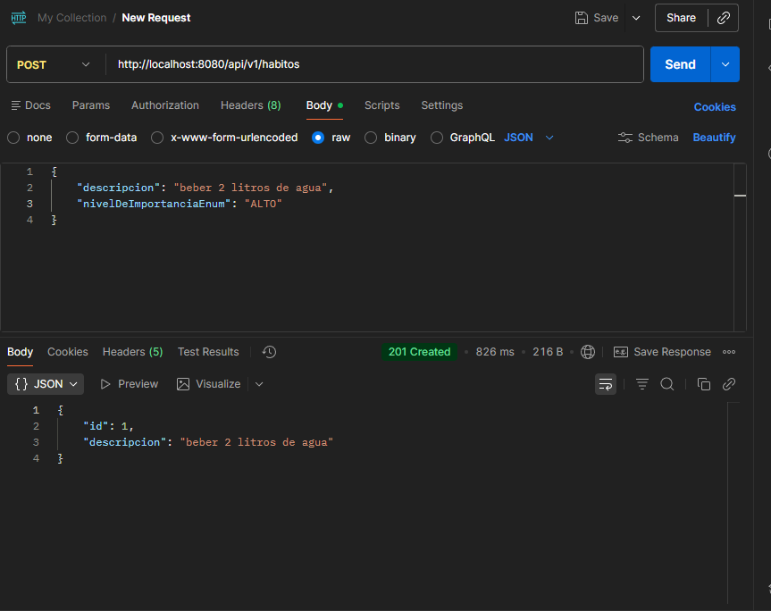
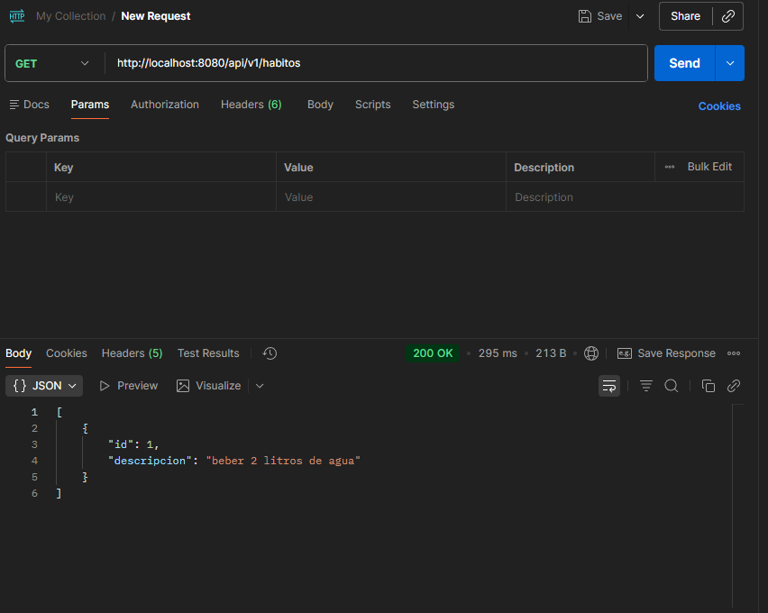
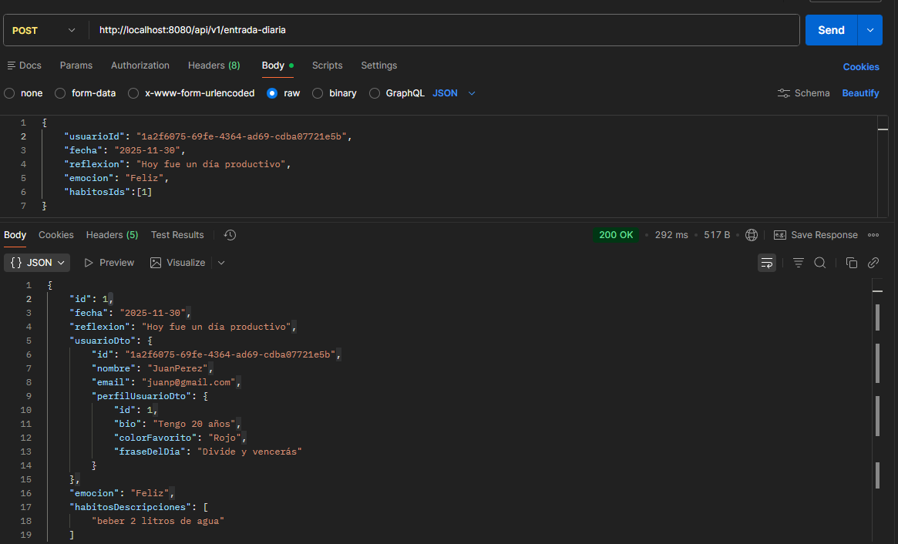
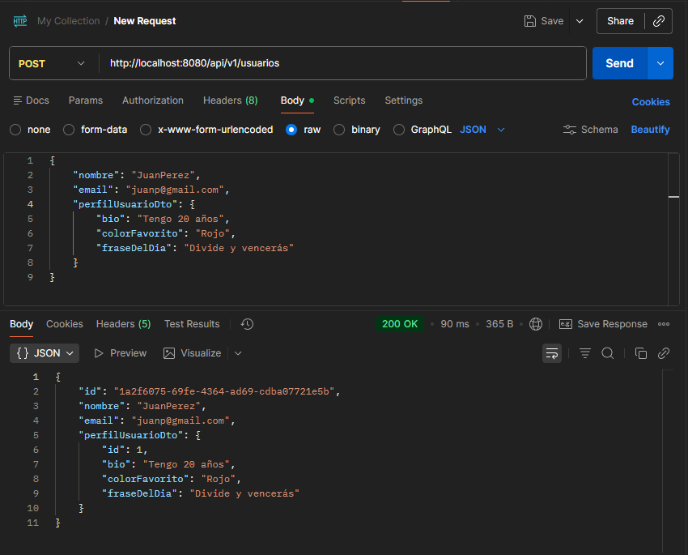

# Moodtrack API

API de Spring Boot para el seguimiento de estados de ánimo y hábitos diarios.

## Prerrequisitos

- Java 21 o superior
- Apache Maven

## Configuración de la Base de Datos

La aplicación puede funcionar con dos bases de datos: H2 (en memoria) o MySQL. La configuración se encuentra en `src/main/resources/application.properties`.

### H2 (Configuración por Defecto)

Esta es la forma más sencilla de ejecutar la aplicación, ya que no requiere ninguna base de datos externa.

```properties
#URL de conexion de H2
spring.datasource.url=jdbc:h2:mem:moodtrackdb
spring.datasource.driver-class-name=org.h2.Driver
spring.datasource.username=sa
spring.datasource.password=

...

#Dialecto de Hibernate
spring.jpa.database-platform=org.hibernate.dialect.H2Dialect

# Activas consola web de H2
spring.h2.console.enabled=true
spring.h2.console.path=/h2-console
```

Con esta configuración, puedes acceder a una consola de base de datos web en `http://localhost:8080/h2-console`.

### MySQL

Si prefieres usar una base de datos MySQL persistente, debes asegurarte de que tu servidor MySQL esté en funcionamiento. Luego, comenta las líneas de H2 y descomenta las de MySQL en `application.properties`:

```properties
#URL de conexion de MYSQL
spring.datasource.url=jdbc:mysql://localhost:3306/moodtrackdb?useSSL=false&serverTimezone=UTC
spring.datasource.username=root
spring.datasource.password=1234
spring.datasource.driver-class-name=com.mysql.cj.jdbc.Driver

...

#Dialecto de Hibernate
spring.jpa.database-platform=org.hibernate.dialect.MySQLDialect
```

**Importante:** Asegúrate de que la base de datos `moodtrackdb` exista en tu servidor MySQL y de que las credenciales (`username` y `password`) sean correctas.

## Cómo Ejecutar la Aplicación

1.  Abre una terminal en la raíz del proyecto.
2.  Ejecuta el siguiente comando de Maven:

    ```bash
    mvn spring-boot:run
    ```

3.  La aplicación se iniciará y estará disponible en `http://localhost:8080`.

## API Endpoints

A continuación se detallan los endpoints disponibles para gestionar usuarios, hábitos y entradas diarias.

---

### Hábitos

#### 1. Crear un Hábito

- **Método:** `POST`
- **URL:** `/api/v1/habitos`
- **Descripción:** Crea un nuevo hábito.
- **Body (JSON):**

  ```json
  {
      "descripcion": "Leer 20 páginas",
      "nivelDeImportanciaEnum": "MEDIO"
  }
  ```

- **Comando `curl`:**

  ```bash
  curl -X POST http://localhost:8080/api/v1/habitos \
  -H "Content-Type: application/json" \
  -d 
  {
      "descripcion": "Leer 20 páginas",
      "nivelDeImportanciaEnum": "MEDIO"
  }
  ```

- **Respuesta Exitosa (201 Created):**

  ```json
  {
      "id": 1,
      "descripcion": "Leer 20 páginas"
  }
  ```



#### 2. Listar todos los Hábitos

- **Método:** `GET`
- **URL:** `/api/v1/habitos`
- **Descripción:** Devuelve una lista de todos los hábitos con su id y descripción.
- **Comando `curl`:**

  ```bash
  curl http://localhost:8080/api/v1/habitos
  ```

- **Respuesta Exitosa (200 OK):**

  ```json
  [
      {
          "id": 1,
          "descripcion": "Leer 20 páginas"
      }
  ]
  ```



---

### Entradas Diarias

#### Crear una Entrada Diaria

- **Método:** `POST`
- **URL:** `/api/v1/entrada-diaria`
- **Descripción:** Crea una nueva entrada diaria para un usuario, asociando opcionalmente una lista de hábitos.
- **Body (JSON):**

  ```json
  {
      "usuarioId": "ID_DEL_USUARIO_EXISTENTE",
      "fecha": "2025-11-29",
      "reflexion": "Hoy fue un día productivo.",
      "emocion": "Feliz",
      "habitosIds": [1, 2]
  }
  ```

- **Comando `curl`:**

  ```bash
  # Nota: Reemplaza "c33b6a38-695a-4286-9883-ef4172arke83" con un ID de usuario válido de tu base de datos.
  curl -X POST http://localhost:8080/api/v1/entrada-diaria \
  -H "Content-Type: application/json" \
  -d 
  {
      "usuarioId": "c33b6a38-695a-4286-9883-ef4172arke83",
      "fecha": "2025-11-29",
      "reflexion": "Hoy fue un día productivo.",
      "emocion": "Feliz",
      "habitosIds": [1]
  }
  ```

- **Respuesta Exitosa (200 OK):**

  ```json
  {
      "id": 1,
      "fecha": "2025-11-29",
      "reflexion": "Hoy fue un día productivo.",
      "emocion": "Feliz",
      "usuarioId": "c33b6a38-695a-4286-9883-ef4172arke83",
      "habitos": [
          {
              "id": 1,
              "descripcion": "Leer 20 páginas"
          }
      ]
  }
  ```



---

### Usuarios

#### Listar todos los Usuarios

- **Método:** `GET`
- **URL:** `/api/v1/usuarios`
- **Descripción:** Devuelve una lista de todos los usuarios. Es útil para obtener un `usuarioId` válido para crear entradas diarias.
- **Comando `curl`:**

  ```bash
  curl http://localhost:8080/api/v1/usuarios
  ```
- **Respuesta Exitosa (200 OK):**
  ```json
  [
      {
          "id": "c33b6a38-695a-4286-9883-ef4172arke83",
          "nombre": "Usuario de Ejemplo",
          "email": "ejemplo@correo.com",
          "perfilUsuarioDto": null
      }
  ]
  ```

#### 2. Crear un Usuario

- **Método:** `POST`
- **URL:** `/api/v1/usuarios`
- **Descripción:** Crea un nuevo usuario en la aplicación.
- **Body (JSON):**

  ```json
  {
      "nombre": "Nuevo Usuario",
      "email": "nuevo.usuario@example.com",
      "perfilUsuarioDto": {
          "bio": "Mi biografía de prueba",
          "colorFavorito": "Azul",
          "fraseDelDia": "Divide y Venceras"
      }
  }
  ```
  *Nota: `perfilUsuarioDto` es opcional. Puedes omitirlo si no deseas crear un perfil junto con el usuario.*

- **Comando `curl`:**

  ```bash
  curl -X POST http://localhost:8080/api/v1/usuarios \
  -H "Content-Type: application/json" \
  -d 
  {
      "nombre": "Nuevo Usuario",
      "email": "nuevo.usuario@example.com",
      "perfilUsuarioDto": {
          "bio": "Mi biografía de prueba",
          "colorFavorito": "Azul",
          "fraseDelDia": "¡A codificar!"
      }
  }
  ```

- **Respuesta Exitosa (200 OK):**

  ```json
  {
      "id": "UN_UUID_GENERADO",
      "nombre": "Nuevo Usuario",
      "email": "nuevo.usuario@example.com",
      "perfilUsuarioDto": {
          "id": 1,
          "bio": "Mi biografía de prueba",
          "colorFavorito": "Azul",
          "fraseDelDia": "¡A codificar!"
      }
  }
  ```

